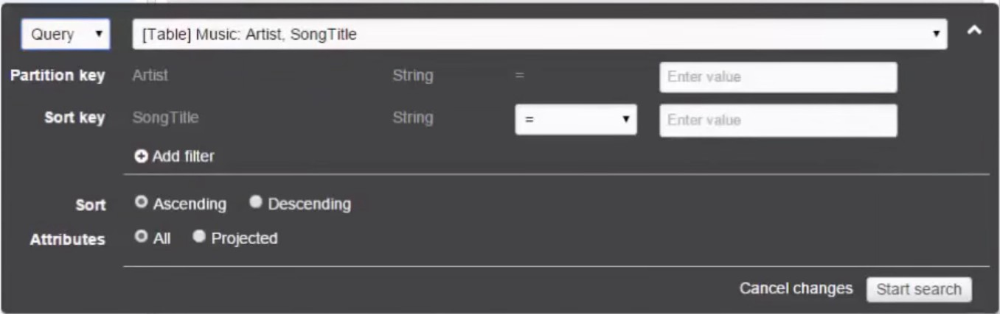

# DynamoDB

## RDS OLTP Relational DBs
* MS SQL Server
* Oracle
* MySQL
* PostgresSQL
* Aurora
* MariadB

## Non-relational DB
* DynamoDB - no SQL
* Redshift - OLAP datawarehousing
* Elasticache - in memory caching.
* DMS

## How to improve db speed?
* Elasticache - either Memcached or Redis.
* It will cache the most consistently queried aspects of your DB.

## DMS - database migration service
* Allows you to migrate your DB to AWS automatically.

## DyanmoDB Facts
* document oriented - collection (table), document(row), key/value pair (fields).
* Single-ditig millisecond latency
* On SSD
* Spread across 3 geographically distinct data centers

## Consistency modes
* **Eventually Consistent Reads** (default). Consistency is delayed, but is reached within 1 seconds.
* **Strongly consistent** reads - consistent immediately prior to the read.

## Basics
* Table 
* Items - row. e.g. students.
* Attribute - column e.g. a student's first name. 
* supports nested attributes up to 32 levels deep.
* You can export table or items into CSV.
* Each primary key attribute must be a scalar (meaning that it can only hold a single value).

## Lab
* Give EC2 IAM role of AmazonDynamoDBFullAccess.

## Primary Keys (unique IDs)
* Two types of primary keys:
1. **Partition Key** aka **Hash Key** - e.g. artist name. DynamoDB uses the partition key's value as input to an internal hash function; the output from the hash function determines the partition where the item is stored.
2. **Partion Key + Sort Key** -  composite primary key. e.g. artist name + song title. All items with the same partition key are stored together, in sorted order by sort key value.
   With a composite primary key, it is possible for two items to have the same partition key value, but those two items must have different sort key values.

## Indexes
* Primary Key allows you to find data. If you want to find data for other attributes, you need to create **Secondary Index**.
* **Local Secondary Index** - an index that has the same partition key as the table, but a different sort key. 
* **Global Secondary Index** -  an index with a partition key and sort key that can be different from those on the table.
* Max **5** local secondary index per table.
* Max **5** global secondary index per table.

## Streams
* captures any modifications to the tables.
* if a new item is added to the table, the stream captures an image of the entire item + all its attributes. Stores it for 24hrs.
* if item is updated, stream captures "before" and "after" images of modified attributes.
* if item is deleted, stream captures image of entire item before it was deleted. 

## Triggers
* Connect Streams to lambda.
* modify item, stream is triggers, lambda is triggered.

## Query API Call
* Query - searches only partition key (primary key) + sort key.
* Returns data matching primary key search.
* Very efficient. Searches indexes only.
* All attribs of an item is returned. but you can use ProjectionExpression parameter so that the query only returns some of the attributes.
* Result is sorted by sort key **ascending**. To make it **descending**, set the **ScanIndexForward** param to **false**.
* by default, it is **eventually consistent**, but can be changed to **strongly consistent**.



## Scan 
* Returns all items (and their attribues) in the table; therefore very inneficient.
* It scans the entire table, then filters out the values to provide the desired results, essentially adding the extra step of removing data from the result set.
* You can use **ProjectionExpression** param so that scan only returns some attribues.
* Only eventual consistent reads are available (not strong consistecy).
* As the table grows, the scan slows.
* The more filters, the slower performance of a scan.

## Query vs Scan
 * Query is more efficient than Scan
 * Avoid using Scan on large table. 

## Provisioned Throughput
* When you create a table, you specify how much provisioned throughput capacity you want to reserve for reads and writes.
* **Capacity unit** - is the unit of provisioned throughput.
* **One Read Capacity unit** 
  ```
  Reads are in blocks of 4KB.
  = Strongly consistent = 1 read per second
  = Eventually consistent = 2 read per second
  ```
* **One Write Capacity Unit**  
    ```
    Writes are in blocks of 1KB.
    one write per second.
    ```
* If you exceed your max allowed provisioned throughput for a table or for one or more global secondary indexes? You get 400 http status code **ProvisionedThroughputExceededException**
## Read Throughput
```
(size of read rounded to the nearest 4KB chunk / 4 KB) x no of items = read throughput. 
divided by 2 if eventually consistent.
```    
e.g. Your app requires to read 10 items (of 1KB ea) per second using eventual consistency. What should you set the throughput to?
* 1KB rounded to the nearest 4KB = 4KB.
* 4KB / 4KB = 1 
* 1 x 10 = 10
* 10 / 2 = 5 units of read throughput.

e.g. App requires to read 10 items of 6KB per second using eventual consistency.
What should you set the read throughput to?
* 6KB rounded to the nearest increment of 4KB = 8KB
* 8KB / 4KB = 2
* 2 x 10 = 20
* 20 / 2 = 10 units of read throughput.

e.g. App requires to read 5 items of 10KB per second using eventual consistency.
* 10KB rounded to nearest 4KB increment = 12KB
* 12KB / 4 = 3
* 3 x 5 = 15
* 15 / 2 = 7.5 = 8 units of read throughput.

## Write Throughput
e.g. App requires to write 5 items. Each item = 10KB per second.
5 x 10KB = 50 write units throughput.

## Web Identity providers to authenticate to DynamoDB
1. User authenticates with ID provider (eg. Google, Facebook).
2. User is given back a token by ID Provider.
3. Your code calls AssumeRoleWithWebIdentity API and provides the ProviderID token and RoleARN for the IAM Role.
4. Your App can now access DyanmoDB from between 15mins to 1hr (default is 1hr).

